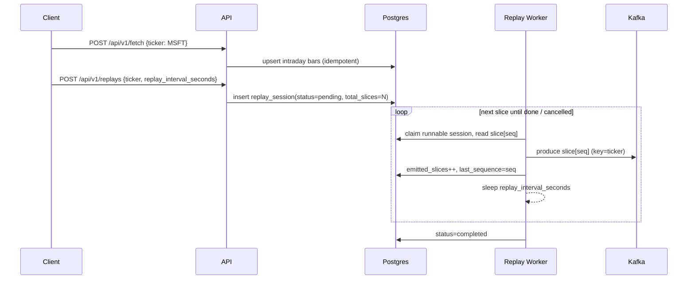

# Spec: `quant_streamingchart` — Intraday Chart Replay to Kafka

## 1. Summary
A backend service that fetches a **1‑day intraday price graph** for a stock ticker (e.g. `MSFT`)
from Yahoo Finance, stores the time series, and then **replays it slice‑by‑slice to a Kafka
topic** with a configurable delay between slices so that downstream order‑execution consumers
have time to react. The intraday "graph" is treated as an ordered series of OHLCV bars
("slices"). Data granularity is compressed to a readable interval (default 1 minute), and the
replay cadence is a separate, configurable wall‑clock delay.

This document is laid out as **vertical implementation slices** (Slice 0 → Slice 6). Each slice
is independently shippable, testable, and builds on the previous one. Slice 0 is a walking
skeleton; every later slice adds one capability end‑to‑end.

The service follows the project
[Backend Coding Standards](https://github.com/mayberryjp/coding_standards/blob/main/BACKEND_CODING_STANDARDS.md)
(Python 3.12, Bottle + Waitress, SQLAlchemy + Alembic, Pydantic Settings, Docker + supervisord,
GitHub Actions CI).

## 2. Goals / Non‑Goals

### Goals
- Fetch a single trading day of intraday bars for a ticker from Yahoo Finance.
- Persist bars idempotently so a day can be replayed repeatedly without re‑fetching.
- Compress/resample bars to a readable interval (default 1m).
- Replay bars in chronological order to Kafka, one slice at a time, with a configurable delay.
- Preserve per‑ticker ordering on the Kafka topic (partition key = ticker).
- Support start / status / cancel of a replay session, with resumable progress.

### Non‑Goals
- No order matching / execution engine — that is a downstream Kafka consumer, out of scope here.
- No live/real‑time market feed — this replays a **historical** day, not a live stream.
- No charting UI or image rendering — "graph" means the underlying time series, not a picture.
- No multi‑day / backfill history — exactly one 1‑day range per fetch (future enhancement).
- No authn/authz in v1 (service assumed to run inside a trusted network).

## 3. High‑Level Architecture

```mermaid
flowchart LR
  YF[Yahoo Finance chart API] -->|HTTP GET range=1d| F[Fetcher]
  F --> DB[(Postgres: instrument_bars)]
  subgraph Service container (supervisord)
    API[Bottle API + Waitress]
    WK[Replay Worker]
  end
  API --> DB
  API --> RS[(replay_sessions)]
  WK --> RS
  WK --> DB
  WK -->|JSON slice, key=ticker| K[(Kafka topic: market.replay.bars)]
  K --> C[Downstream order-execution consumers]
```

Replay sequence:



The service is a **single deployable** running two supervisord programs — the `api` and the
`replay_worker` — plus the one‑shot `migrate` program (Alembic), exactly as prescribed by the
coding standards (Section 11). Postgres and Kafka are **external dependencies** that already
exist; per the standards, `docker-compose.yml` defines only this app, not its dependencies.

## 4. Technology Stack (aligned to standards)

| Concern | Choice |
|---|---|
| Language / runtime | Python 3.12 |
| Web framework | Bottle + Waitress |
| Persistence | Postgres via SQLAlchemy 2.0 (`psycopg[binary]`) |
| Migrations | Alembic |
| Config | Pydantic Settings |
| HTTP client (Yahoo) | `httpx` |
| Kafka producer | `confluent-kafka` |
| Process manager | supervisord (`migrate`, `api`, `replay_worker`) |
| Lint / type / security / test | ruff, mypy, bandit, pytest |

Additions beyond the standard baseline `pyproject.toml` dependencies:
- runtime: `httpx`, `confluent-kafka`
- dev: `respx` (httpx mocking), `pytest-cov` (coverage gate)

## 5. Repository Layout
Concrete instance of the canonical layout (standards Section 2). Package name `streamchart`.

```text
quant_streamingchart/
  .github/workflows/
    ci.yml
    docker-publish.yml
  alembic/
    env.py
    script.py.mako
    versions/
  src/streamchart/
    api/
      app.py
      api_main.py
      routes/
        health.py
        fetch.py
        bars.py
        replays.py
    domain/
      bars.py            # Bar / Slice models, resampling logic
      replay.py          # ReplaySession model, state machine, timing
    repository/
      bars_repo.py
      replays_repo.py
    integrations/
      yahoo.py           # Yahoo chart API client
      kafka_producer.py  # Kafka producer wrapper + message schema
    workers/
      replay_worker.py   # main() replay loop
    config.py
    db.py
    logging.py
    __init__.py
    __main__.py
  tests/
    conftest.py
    ...
  .dockerignore
  .env.example
  .gitignore
  alembic.ini
  docker-compose.yml
  Dockerfile
  pyproject.toml
  README.md
  supervisord.conf
  SPEC.md
```

## 6. Configuration
One Pydantic `Settings` object (standards Section 4), `env_prefix="SERVICE_"`, with explicit
aliases for shared platform vars.

| Setting | Env var | Default | Notes |
|---|---|---|---|
| `database_url` | `DATABASE_URL` | — (required) | SQLAlchemy URL |
| `api_listen_address` | `API_LISTEN_ADDRESS` | `0.0.0.0` | |
| `api_port` | `API_PORT` | `8000` | |
| `log_level` | `SERVICE_LOG_LEVEL` | `INFO` | |
| `yf_base_url` | `SERVICE_YF_BASE_URL` | `https://query1.finance.yahoo.com/v8/finance/chart` | |
| `yf_user_agent` | `SERVICE_YF_USER_AGENT` | `quant-streamingchart/0.1 (+contact: /u/homelabids)` | Yahoo requires a UA; contact per project preference |
| `yf_timeout_seconds` | `SERVICE_YF_TIMEOUT_SECONDS` | `10` | |
| `default_ticker` | `SERVICE_DEFAULT_TICKER` | `MSFT` | |
| `base_interval` | `SERVICE_BASE_INTERVAL` | `1m` | Yahoo `interval` param |
| `source_range` | `SERVICE_SOURCE_RANGE` | `1d` | Yahoo `range` param |
| `target_interval` | `SERVICE_TARGET_INTERVAL` | `1m` | resample target (readability) |
| `replay_interval_seconds` | `SERVICE_REPLAY_INTERVAL_SECONDS` | `1.0` | wall‑clock delay between slices |
| `replay_worker_poll_seconds` | `SERVICE_REPLAY_WORKER_POLL_SECONDS` | `2` | idle poll cadence |
| `kafka_bootstrap_servers` | `SERVICE_KAFKA_BOOTSTRAP_SERVERS` | — (required for replay) | |
| `kafka_topic` | `SERVICE_KAFKA_TOPIC` | `market.replay.bars` | |
| `kafka_client_id` | `SERVICE_KAFKA_CLIENT_ID` | `streamchart-producer` | |
| `kafka_acks` | `SERVICE_KAFKA_ACKS` | `all` | durability |

Only `.env.example` is committed; `.env` is git‑ignored (standards Section 13a).

## 7. Data Model
Postgres, one service‑specific Alembic version table. All timestamps are `timestamptz` (UTC).
Prices are `NUMERIC(18,6)`.

### `instrument_bars` — cached fetched intraday series
| Column | Type | Notes |
|---|---|---|
| `id` | bigserial PK | |
| `ticker` | text | uppercased |
| `interval` | text | e.g. `1m` |
| `bar_time` | timestamptz | bar open time |
| `open` / `high` / `low` / `close` | numeric(18,6) | |
| `volume` | bigint | nullable |
| `source` | text | `yahoo` |
| `fetched_at` | timestamptz | |

Constraint: `UNIQUE (ticker, interval, bar_time)` → upsert target (idempotent re‑fetch).

### `replay_sessions` — one replay run
| Column | Type | Notes |
|---|---|---|
| `id` | uuid PK | |
| `ticker` | text | |
| `interval` | text | target interval used for slices |
| `replay_interval_seconds` | numeric(6,3) | delay between slices |
| `kafka_topic` | text | resolved at creation |
| `status` | text | `pending`/`running`/`completed`/`failed`/`cancelled` |
| `total_slices` | int | computed at creation |
| `emitted_slices` | int | progress |
| `last_sequence` | int | last emitted seq (resume point), `-1` initial |
| `error` | text | nullable |
| `created_at` / `started_at` / `completed_at` | timestamptz | |

### `replay_events` — per‑slice emission audit (idempotency + resume)
| Column | Type | Notes |
|---|---|---|
| `id` | bigserial PK | |
| `session_id` | uuid FK → replay_sessions | |
| `sequence` | int | |
| `bar_time` | timestamptz | |
| `emitted_at` | timestamptz | |
| `kafka_partition` | int | from delivery report |
| `kafka_offset` | bigint | from delivery report |

Constraint: `UNIQUE (session_id, sequence)`.

## 8. Kafka Message Contract
- **Topic:** `market.replay.bars` (configurable).
- **Key:** `ticker` (UTF‑8 bytes) → guarantees all slices for a ticker land on one partition and
  are consumed **in order**, which is what makes order execution deterministic.
- **Value:** JSON, UTF‑8:

```json
{
  "schema_version": 1,
  "session_id": "0f2b…",
  "ticker": "MSFT",
  "sequence": 42,
  "interval": "1m",
  "bar_time": "2026-08-21T14:30:00Z",
  "open": 415.20,
  "high": 415.80,
  "low": 415.10,
  "close": 415.55,
  "volume": 120000,
  "emitted_at": "2026-08-23T10:00:42Z",
  "is_first": false,
  "is_last": false
}
```

- Producer config: `acks=all`, `enable.idempotence=true`. `sequence` + `session_id` let
  consumers dedupe if the worker is restarted mid‑run.

## 9. Replay Timing Model
Two independent axes — do not conflate them:

1. **Data compression (granularity).** Raw source bars (default 1m from Yahoo) may be resampled
   to a coarser, more readable `target_interval` (e.g. 5m) using OHLCV aggregation:
   `open=first, high=max, low=min, close=last, volume=sum`.
2. **Replay cadence (wall clock).** The worker emits one slice, then sleeps
   `replay_interval_seconds` (default `1.0s`) before the next. This delay is the window in which
   downstream order execution runs. Total replay duration ≈ `total_slices × replay_interval_seconds`
   (e.g. 390 × 1s ≈ 6.5 min for a full 1m day).

`replay_interval_seconds` is fixed per session in v1 (uniform bar spacing makes this sufficient).
A time‑compression **speed factor** that preserves uneven gaps is a documented future
enhancement (Section 14).

## 10. API Surface
All responses use the JSON error envelope and HTTP status mapping from standards Sections 6–7.
Base path `/api/v1`. Required platform endpoints `/health` and `/ready`.

| Method / path | Purpose |
|---|---|
| `GET /health` | process alive |
| `GET /ready` | DB reachable (+ Kafka broker metadata reachable once Slice 3 lands) |
| `POST /api/v1/fetch` | `{ticker, interval?, range?}` → fetch + upsert bars; returns `{ticker, interval, count, first_bar, last_bar}` |
| `GET /api/v1/bars` | `?ticker=&interval=` → ordered bars (supports computed resample interval) |
| `POST /api/v1/replays` | `{ticker, interval?, replay_interval_seconds?, topic?}` → create session (`pending`); 422 if no bars stored |
| `GET /api/v1/replays` | list sessions |
| `GET /api/v1/replays/{id}` | status + progress `{status, emitted_slices, total_slices, percent, last_sequence}` |
| `POST /api/v1/replays/{id}/cancel` | request cancellation |

---

# Implementation Slices

Each slice lists **Objective → Deliverables → Behavior → Acceptance → Tests**. A slice is "done"
only when it meets the standards' Definition of Done (Section 21): ruff, mypy, bandit, pytest all
pass and `alembic upgrade head` succeeds.

## Slice 0 — Walking Skeleton
**Objective:** A runnable, deployable service with health/readiness and full toolchain, no
business logic yet.

**Deliverables**
- Repo layout (Section 5), `pyproject.toml` (standards Section 3 + `httpx`, `confluent-kafka`).
- `config.py`, `logging.py`, `db.py` (engine + `check_database()`).
- `api/app.py` `create_app()` factory, `api/routes/health.py` (`/health`, `/ready`), JSON 404.
- `api/api_main.py` (Waitress entrypoint), `__main__.py`.
- Alembic baseline (empty head), `alembic.ini`, `env.py` (reads `DATABASE_URL`, service version table).
- `Dockerfile`, `supervisord.conf` (`migrate` + `api`), `docker-compose.yml` (image ref only),
  `.dockerignore`, `.gitignore`, `.env.example`, `README.md`, CI `ci.yml`.

**Behavior**
- `/health` → `{"status":"ok","service":"streamchart-api"}`.
- `/ready` → `SELECT 1`; `503` envelope if DB unreachable.

**Acceptance**
- `docker compose up` starts; `migrate` runs before `api`; `GET /health` = `ok`.
- ruff / mypy / bandit / pytest green in CI.

**Tests:** `test_health.py`, `test_ready.py` (happy + DB‑down path).

## Slice 1 — Yahoo Intraday Fetch + Storage
**Objective:** Pull one 1‑day intraday series and persist it idempotently.

**Deliverables**
- `integrations/yahoo.py`: GET `{yf_base_url}/{ticker}?interval={base_interval}&range={source_range}`
  with `User-Agent: {yf_user_agent}`; parse `chart.result[0]` timestamps + `indicators.quote[0]`
  into `Bar` objects; skip null gaps.
- `domain/bars.py`: `Bar` model.
- `repository/bars_repo.py`: upsert on `(ticker, interval, bar_time)`; ordered read.
- Alembic migration: `instrument_bars`.
- Routes: `POST /api/v1/fetch`, `GET /api/v1/bars`.

**Behavior**
- Uppercase ticker; reject unknown/empty result with `422` envelope (e.g. non‑trading day).
- Re‑fetch is idempotent (no duplicate rows).

**Acceptance**
- `POST /api/v1/fetch {"ticker":"MSFT"}` stores a full day (~390 1m bars) and returns count + range.
- `GET /api/v1/bars?ticker=MSFT` returns bars in ascending `bar_time`.

**Tests:** parser unit test from a recorded Yahoo JSON fixture; upsert idempotency test;
route test with `respx`‑mocked Yahoo call (no live network in CI).

## Slice 2 — Compression / Resampling
**Objective:** Aggregate base bars into a readable target interval.

**Deliverables**
- `domain/bars.py`: pure `resample(bars, target_interval) -> list[Bar]`
  (`open=first, high=max, low=min, close=last, volume=sum`; right‑labelled, left‑closed windows).
- `GET /api/v1/bars?interval=5m` returns computed bars when target ≠ base.

**Behavior**
- `1m` target is a no‑op passthrough. Partial trailing window still emits a bar.

**Acceptance**
- 390 × 1m → 78 × 5m with correct OHLCV aggregation on a fixture.

**Tests:** table‑driven resample unit tests (boundaries, single‑bar window, empty input).

## Slice 3 — Kafka Producer
**Objective:** Publish one slice to Kafka with the message contract.

**Deliverables**
- `integrations/kafka_producer.py`: `confluent-kafka` `Producer` wrapper; `build_message(slice)`
  → (key=ticker bytes, value=JSON); `produce()` + delivery callback capturing partition/offset;
  `flush()`; `enable.idempotence=true`, `acks=all`.
- Extend `/ready` to also verify broker metadata is reachable (best‑effort, short timeout).

**Behavior**
- Serialization is deterministic and matches Section 8. Delivery errors are logged and surfaced
  to the caller (worker) for retry/failure handling.

**Acceptance**
- Unit test asserts key = `b"MSFT"` and value JSON matches the contract for a known slice.

**Tests:** `build_message` serializer test; producer wrapper test with a fake/mock producer
(no live broker in CI); optional broker integration test gated behind an env flag.

## Slice 4 — Replay Session Model + API
**Objective:** Persist and manage replay sessions (no streaming yet).

**Deliverables**
- `domain/replay.py`: `ReplaySession` + status state machine
  (`pending→running→completed|failed|cancelled`, `running→cancelled`).
- `repository/replays_repo.py`: create / get / list / update progress / request‑cancel.
- Alembic migration: `replay_sessions`, `replay_events`.
- Routes: `POST /api/v1/replays`, `GET /api/v1/replays`, `GET /api/v1/replays/{id}`,
  `POST /api/v1/replays/{id}/cancel`.

**Behavior**
- On create: resolve interval/topic/delay from body or config, count available slices →
  `total_slices`, `status=pending`, `last_sequence=-1`. `422` if no bars exist for ticker/interval.

**Acceptance**
- Create returns `pending` with correct `total_slices`.
- Cancel on a `pending`/`running` session flips to `cancelled`; illegal transitions rejected with
  `409`.

**Tests:** repository CRUD + state‑transition tests; route tests incl. `422` (no bars) and
`409` (bad transition).

## Slice 5 — Replay Worker (Streaming Engine)
**Objective:** Stream a session's slices to Kafka in order, with delay, resumably.

**Deliverables**
- `workers/replay_worker.py` `main()` loop (standards Section 10): poll every
  `replay_worker_poll_seconds` for a runnable session; claim it (`pending→running`, set
  `started_at`).
- For the claimed session, iterate slices from `last_sequence + 1`:
  produce to Kafka → record `replay_events` row → `emitted_slices++`, `last_sequence=seq`
  → `sleep(replay_interval_seconds)`. Set `is_first`/`is_last` flags. On completion set
  `status=completed`, `completed_at`.
- Honor cancellation between slices (`cancelled`, stop emitting).
- On error: bounded retry, then `status=failed` + `error`.

**Behavior**
- **Idempotent / resumable:** progress is checkpointed per slice; a worker restart mid‑run
  resumes at `last_sequence + 1` with no duplicate emissions (guarded by
  `UNIQUE(session_id, sequence)`).
- Ordering preserved via single partition key (ticker).

**Acceptance**
- End‑to‑end: fetch → create replay → worker emits all `total_slices` with the configured delay;
  `status=completed`, `emitted_slices == total_slices`.
- Cancel mid‑run halts emission promptly; `status=cancelled`.
- Kill + restart worker mid‑run → run finishes with no duplicate slices.

**Tests:** worker unit tests with a fake producer + injected clock (no real sleeping);
resume‑after‑restart test; cancel test; failure/retry test.

## Slice 6 — Hardening & Observability
**Objective:** Production‑readiness per the standards' Definition of Done.

**Deliverables**
- Request logging with `method, path, status_code, duration_ms, request_id` (standards Section 15).
- Counters: bars fetched, slices emitted, produce errors (logged/metric hooks).
- `README.md` runbook (install / migrate / run / test / compose).
- `docker-publish.yml` (tag‑triggered image publish).
- CI coverage gate ≥ 80% (`pytest-cov`).

**Acceptance**
- Definition of Done (standards Section 21) satisfied end‑to‑end.

**Tests:** logging middleware test; coverage gate enforced in CI.

---

## 11. Testing Strategy
- **Unit:** Yahoo parser, resampler, message serializer, session state machine, worker loop
  (fake producer + injected clock).
- **Repository:** upsert idempotency, progress checkpointing, unique constraints — against a real
  Postgres service in CI (standards Section 17).
- **API:** health/ready, fetch (mocked Yahoo via `respx`), replay lifecycle, error envelopes.
- **Migration smoke:** `alembic upgrade head` in CI is mandatory.
- **Optional integration:** real Kafka broker, gated behind an env flag so CI stays hermetic.
- No live Yahoo or Kafka calls in the default CI path.

## 12. Definition of Done (per standards Section 21)
1. `ruff`, `mypy`, `bandit`, `pytest` pass.
2. `alembic upgrade head` succeeds on Postgres.
3. Docker image builds without cloning source; runs as non‑root; no `HEALTHCHECK` baked in.
4. `docker compose up` starts the service; `/health` = `ok`.
5. Logs and readiness output are actionable.

## 13. Open Questions
- Which `MSFT`‑style tickers/exchanges must be supported beyond US equities (affects session hours)?
- Kafka partition count / retention expectations from the consuming team?
- Is a Schema Registry (Avro/Protobuf) required, or is versioned JSON sufficient for v1?

## 14. Future Enhancements
- **Speed factor** replay that preserves real inter‑bar gaps (`emit at bar_time_delta / factor`).
- Multi‑day / date‑range backfill and replay.
- Multiple concurrent sessions / multiple tickers per topic with N partitions.
- Avro/Protobuf + Schema Registry.
- Live (non‑replay) pass‑through mode.
